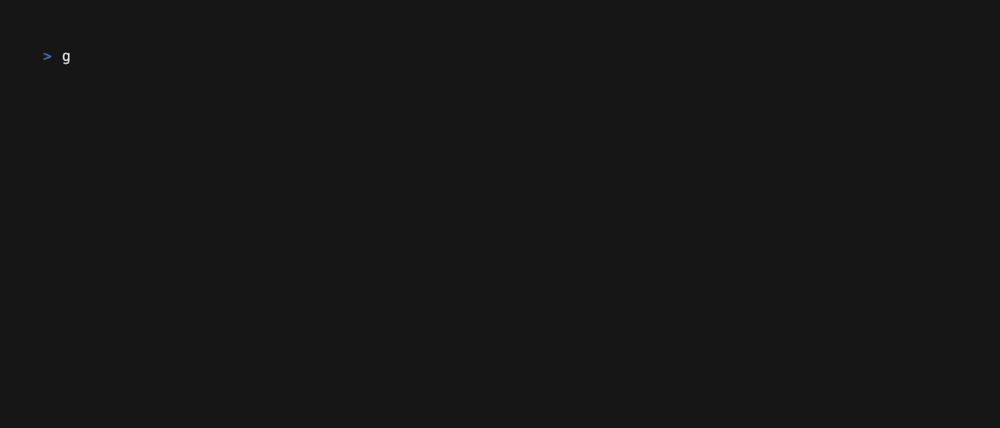

# GoLDAP : a Friendly Face for Your LDAP Server

A TUI app for managing LDAP POSIX accounts and groups

<p>
    
</p>

## Motivation

- Are you tired of using bash scripts or outdated desktop apps for managing your LDAP users?
- You don't want to write a [`ldif`](./scripts/0-ous.ldif) or a long query in the terminal.
- You need a quick way to update your LDAP entries and get on with your life?

Me too. So I wrote `goldap` to do the above using a user-friendly app in a terminal.

## Features

- Browsing users and groups (POSIX accounts and groups in LDAP).
- Modifying entry attributes, e.g., passwords, emails, etc.
    - Updating (moving) DN records not yet supported.
- Adding new entries to POSIX accounts, groups, and OrgUnits.
- Deleting entries.

## Quick Start

1. Install Go from [webinstall.dev](https://webinstall.dev/golang/)
or [go.dev](https://go.dev/doc/install). Go is only
used during the installation process and not required after building `goldap`.
    ```bash
    curl -sS https://webi.sh/golang | sh; \
    source ~/.config/envman/PATH.env
    ```
1. Use Go to install `goldap`:
    ```bash
    go install github.com/mshagirov/goldap@latest
    ```
1. Create a `.goldapconfig.json` configuration file in your home folder and enter
your LDAP URL, admin and base DN (an example configuration file is shown when
`goldap` can't find one).
1. Start GoLDAP by simply entering:
    ```bash
    goldap
    ```

## Usage

### Navigation Commands and Keybindings

|               Keys            |          Command         |
|:-----------------------------:|:------------------------:|
|  `tab`, `n`, `shift-tab`, `p` |     Next/previous tab    |
|  `down` and `up` arrows, or `j` and `k` | Row navigation |
|             `enter`           | Open an entry (row) for viewing and editing   |
|            `ctrl-a`           | Add a new entry to LDAP (current tab)         |
|            `ctrl-d`           | Delete an entry from LDAP (current tab)       |
|         `/` or `?`   | Search (press `enter` to change the focus to the table)|
|    `esc` and `ctrl-c`         | Exit program or cancel search |

### Configuration

The configuration file `.goldapconfig.json` must be located in *user's home folder*.
The configuration must specify LDAP server details,

- URL
- Base DN
- Admin DN

E.g.:

```json
{
  "LDAP_URL":"ldap://localhost:8389",
  "LDAP_BASE_DN":"dc=goldap,dc=sh",
  "LDAP_ADMIN_DN":"cn=admin,dc=goldap,dc=sh"
}
```

Configuration may also contain optional preferred or *default* attributes and
*templates* to be used when creating a *new* entries.

GoLDAP supports basic templates,
where a template (`{{ATTRIBUTE_NAME}}`) is replaced by a value of
a given attribute. Generally used for home folders and emails as shown below.

```json
{
  "LDAP_URL":"ldap://localhost:8389",
  "LDAP_BASE_DN":"dc=goldap,dc=sh",
  "LDAP_ADMIN_DN":"cn=admin,dc=goldap,dc=sh",

  "Users": [
    { "Name": "ou", "Value": [ "People" ] },
    { "Name": "objectClass", "Value": [ "posixAccount", "inetOrgPerson", "top" ] },
    { "Name": "employeeType", "Value": [ "Staff" ] },
    { "Name": "uid", "Value": [ "USERNAME" ] },
    { "Name": "givenName", "Value": [ "NAME" ] },
    { "Name": "sn", "Value": [ "SURNAME" ] },
    { "Name": "mail", "Value": [ "{{uid}}@goldap.sh" ] },
    { "Name": "uidNumber", "Value": [ "1234" ] },
    { "Name": "gidNumber", "Value": [ "Enter group gidNumber, e.g., 100" ] },
    { "Name": "homeDirectory", "Value": [ "/home/{{uid}}" ] },
    { "Name": "userPassword", "Value": [ "password" ] },
    { "Name": "description", "Value": [ "description" ] }
  ],
  "Groups": [
    { "Name": "ou", "Value": [ "" ] },
    { "Name": "objectClass", "Value": [ "top", "posixGroup" ] },
    { "Name": "cn", "Value": [ "Group's name" ] },
    { "Name": "gidNumber", "Value": [ "" ] },
    { "Name": "member", "Value": [ "asimov", "hseldon", "rdolivaw", "..." ] },
    { "Name": "memberUid", "Value": [ "asimov", "hseldon", "rdolivaw", "..." ] }
  ],
  "OrgUnits": [
    { "Name": "ou", "Value": [ "" ] },
    { "Name": "objectClass", "Value": [ "top", "organizationalUnit" ] },
    { "Name": "description", "Value": [ "description" ] }
  ]
}
```

## Contributing and Extending

If you'd like to contribute, please fork the repository and open a pull request
to the `main` branch.

### LDAP Development Server

Use docker or podman and [`scripts/local-test-server.sh`](./scripts/local-test-server.sh)
to start LDAP server for development. Also, take a look at [`AGENTS.md`](./AGENTS.md)
(can be used with agentic tools).
